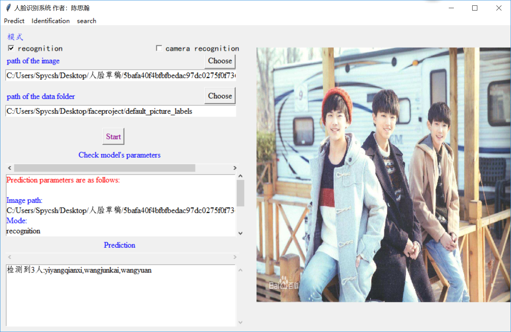
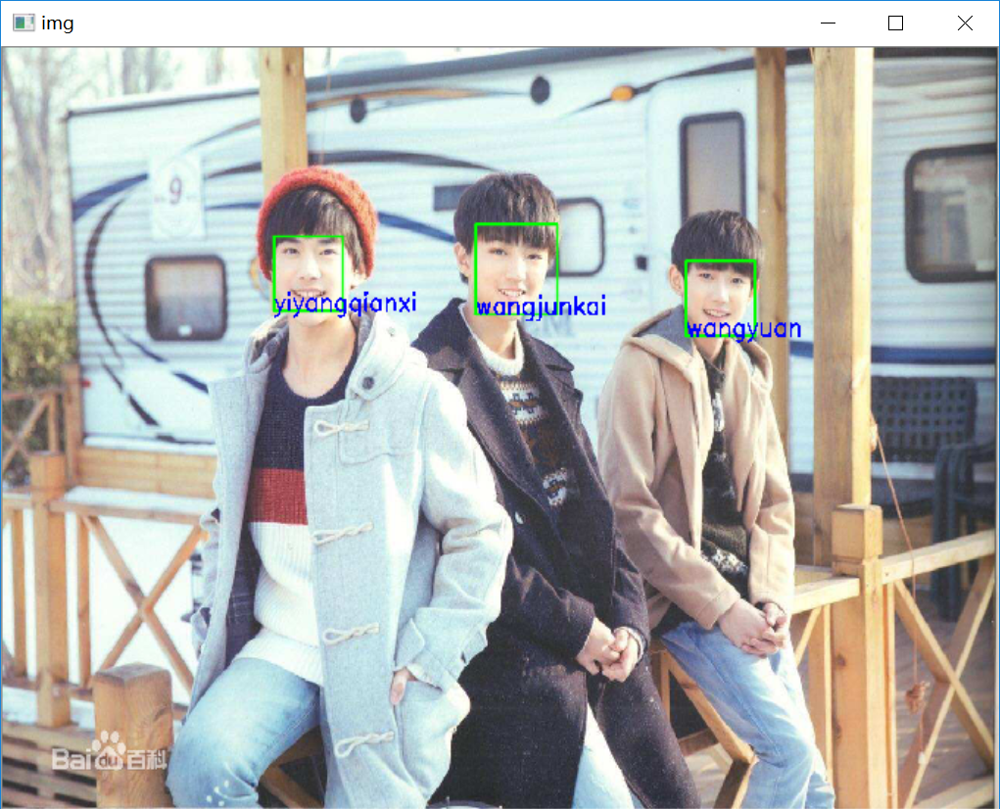
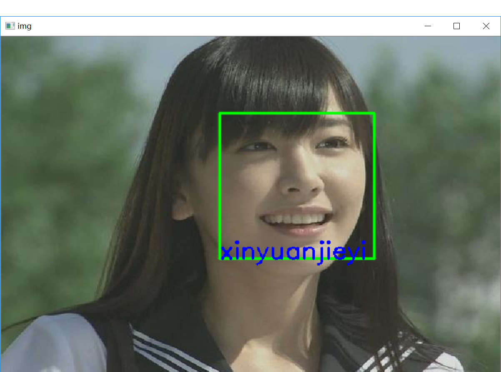
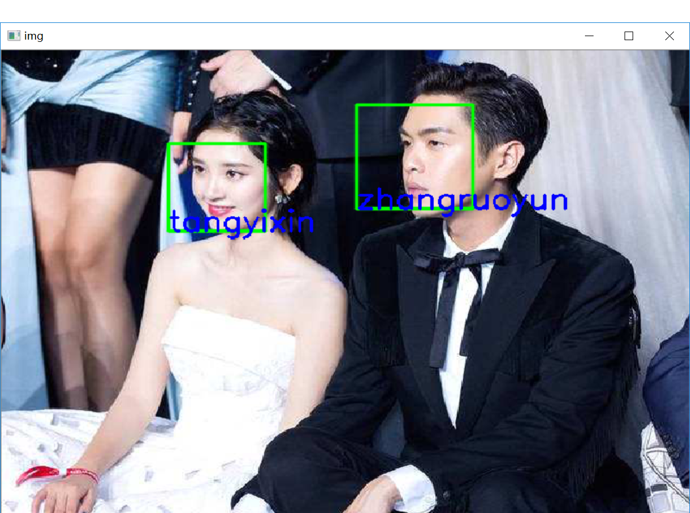
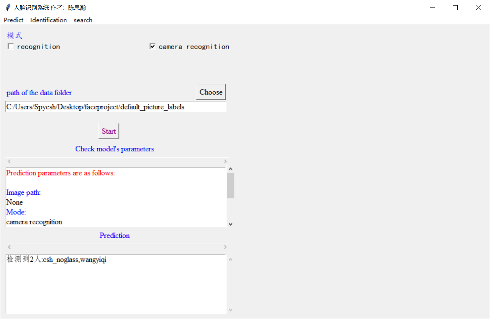
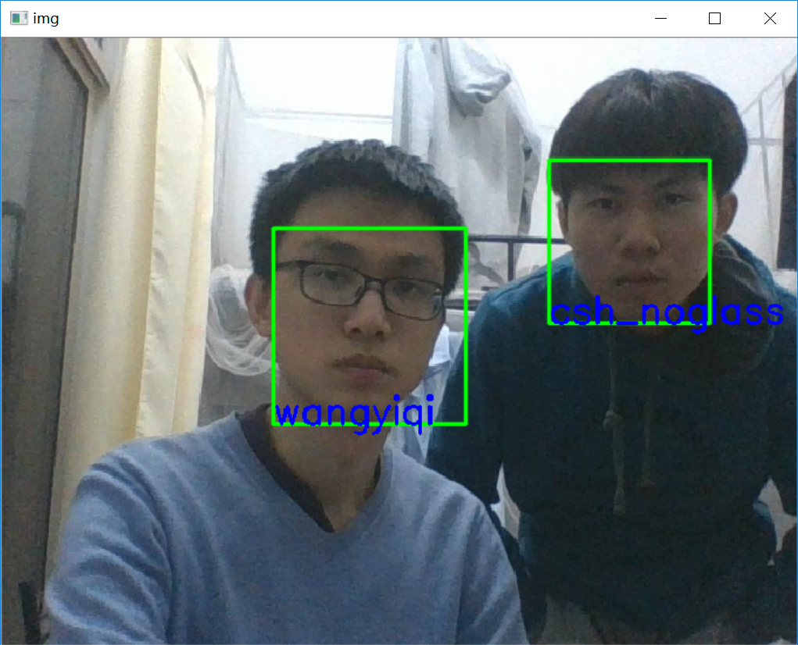

# Faceproject
## GUI 实现
>描述:一个集成了人脸识别、人脸认证、人脸查找等功能的界面。

**camera_photo**

用以存放predict功能本地照取的照片

**camera_photo_identification**

存放identification功能本地照取的照片

**default_label_identification**

存放identification功能的比对样本图片

**default_picture_labels**

存放predict功能的比对样本图片

**face_recognition**

核心识别逻辑

**ui_with_tkinter**

利用tkinter实现的界面

**resources**

进入界面背景资源，以及模型资源

## 人脸识别页面
### 普通识别展示

#### *More...*

### 摄像头识别展示>_>

## 人脸认证页面
### 微笑识别/眨眼识别
>通过某种动作进行活体验证<_<

## 人脸查找页面
### *Faster and More concise!*
>只检测您需要查找的人脸<_<

* *Thanks for reading!*
