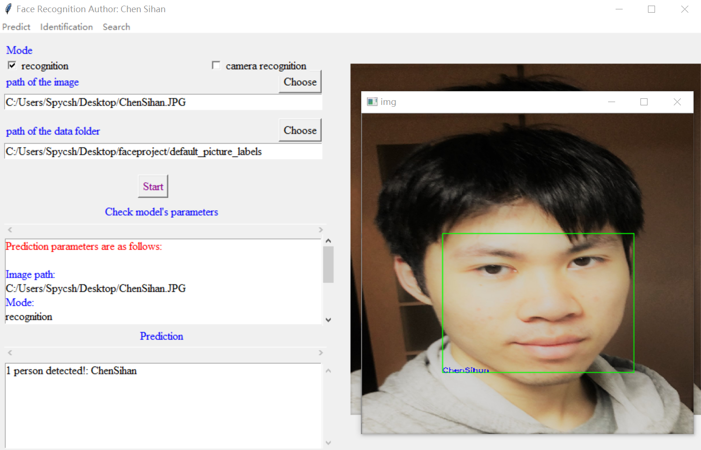
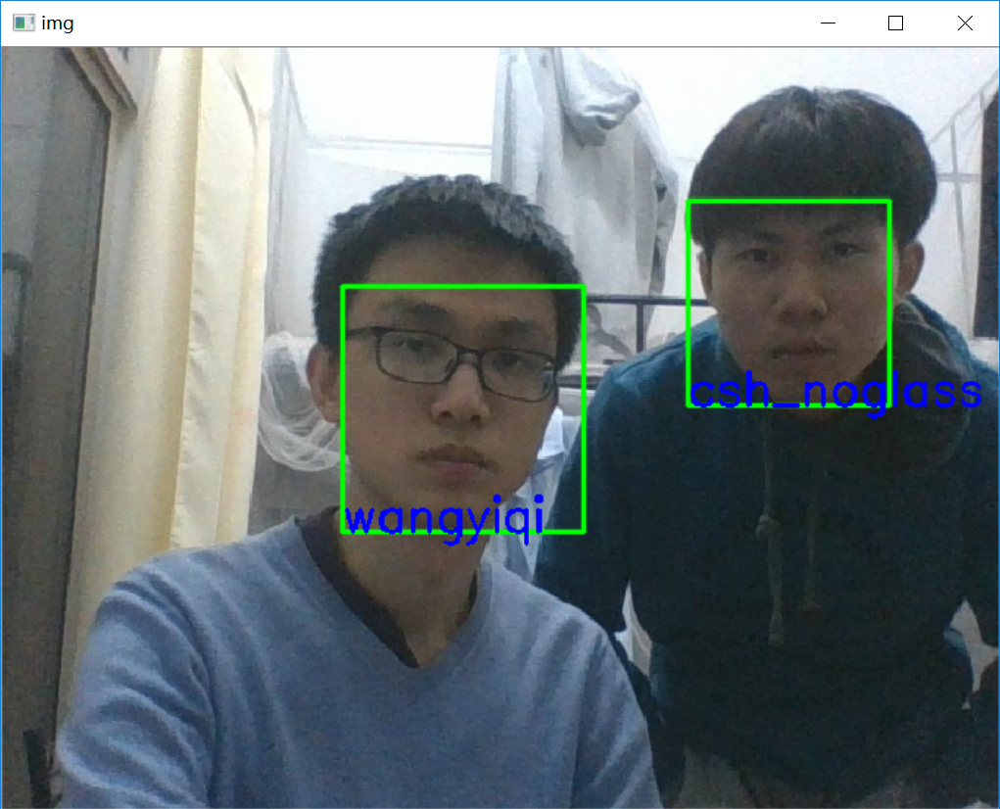
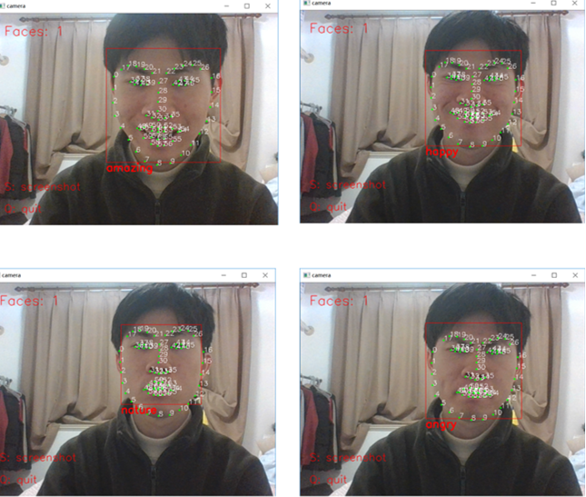
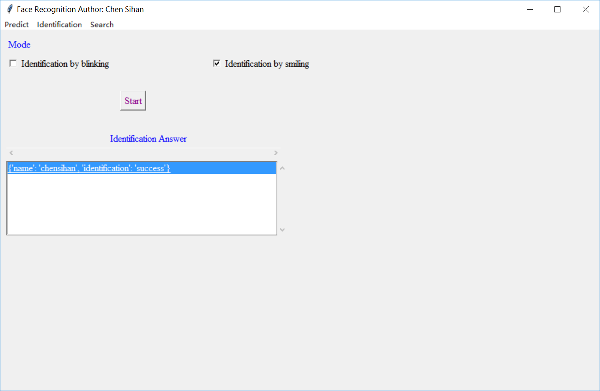
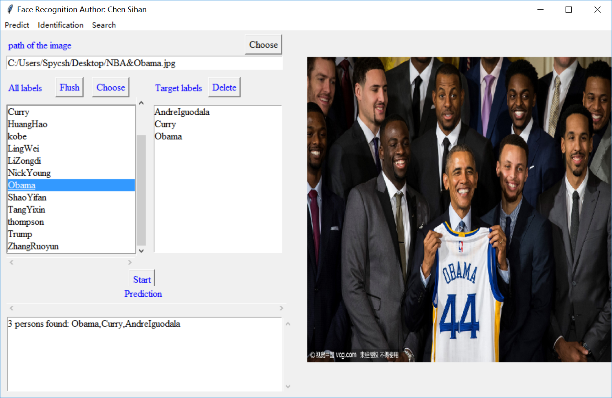
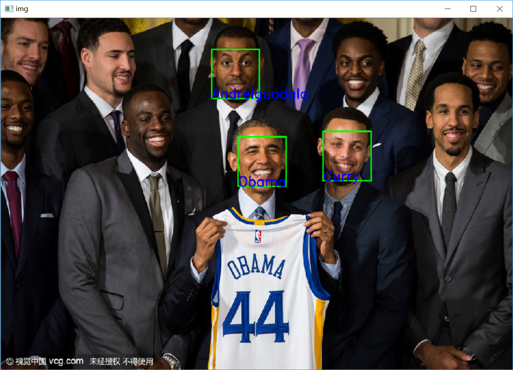
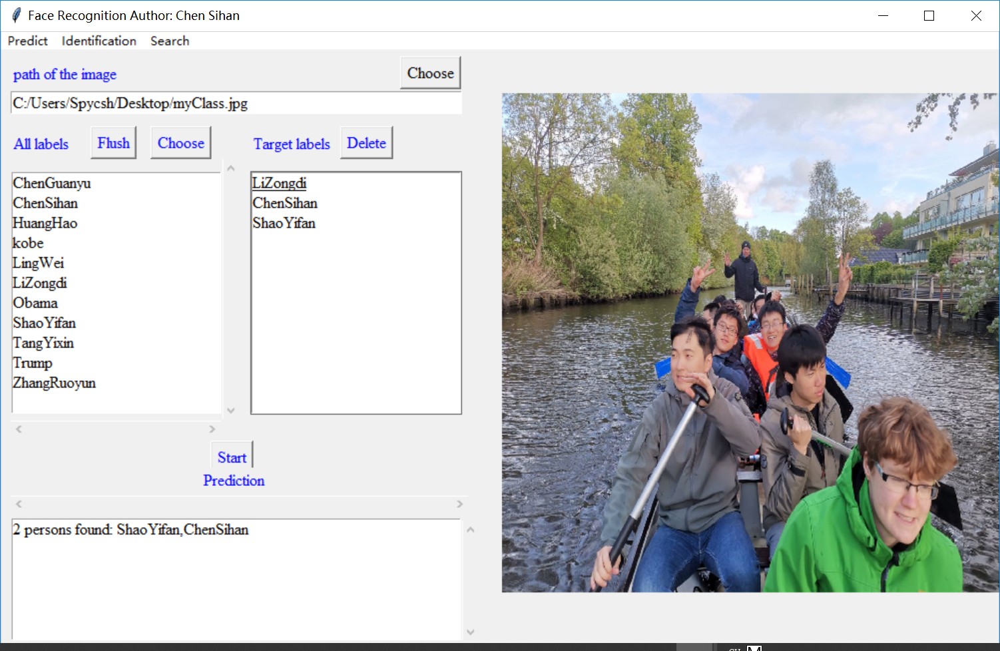
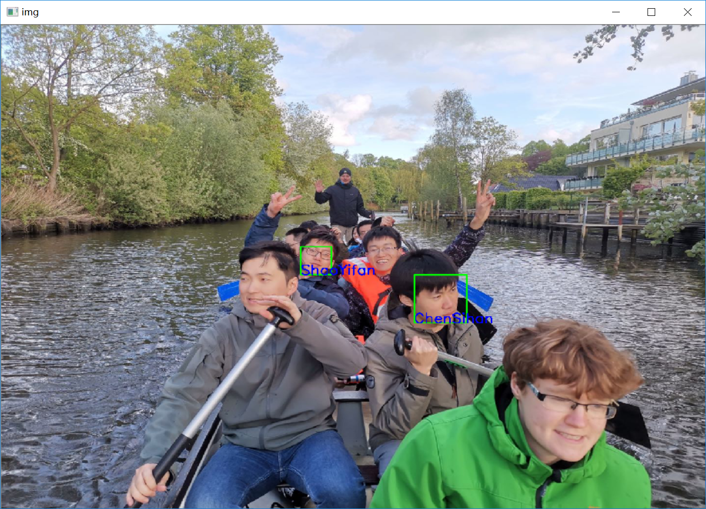
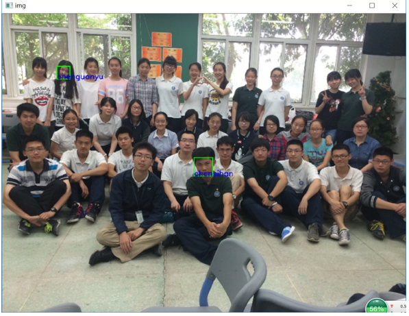

# **Face Recognition Software**

## *GUI implementation*

> Author: Sihan Chen

---
## **Project structure**

```
+--ui_with_tkinter
|    +--face_recognition_ui.py
|    +--__init__.py

+--resources
|    +--dlib_face_recognition_resnet_model_v1.dat
|    +--Entrance.png
|    +--Entrance_EnglishVersion.jpg
|    +--shape_predictor_68_face_landmarks.dat

+--face_recognition
|    +--identification.py
|    +--README.md
|    +--search.py
|    +--test_images.py
|    +--__init__.py

+--camera_photo
|    +--README.md

+--camera_photo_identification
|    +--README.md

+--default_label_identification
|    +--chensihan.JPG
|    +--README.md
+--default_picture_labels
|    +--csh.jpg
|    +--kobe.jpg
|    +--README.md

+--default_search_labels
|    +--ChenGuanyu.png
|    +--ChenSihan.JPG
|    +--Obama.jpg
|    +--README.md
|    +--TangYixin.jpg
|    +--Trump.jpg
|    +--ZhangRuoyun.jpg

```

## **Entrance interface**

> Entrance picture designer: ShiYing Hou


## **Core Functions Introduction**

### **face predict**
#### *Image predict*



#### *Camaera predict*

> My friend and me



### **face identification**

#### *Identification by emotions (current blinking/smiling in use)*


* Choose the action you need to do to show you are a live body rather than a picture
* First the `Identification` function will call the camera to identify the user
* Them when you do certain actions ( Blink or Smile)
* You will be accepted



### **Face Search**

#### *Search Curry, Obama and Iguodala*



#### *Search my classmate and me*





#### *More...*


---

> #  *Thanks for reading!*